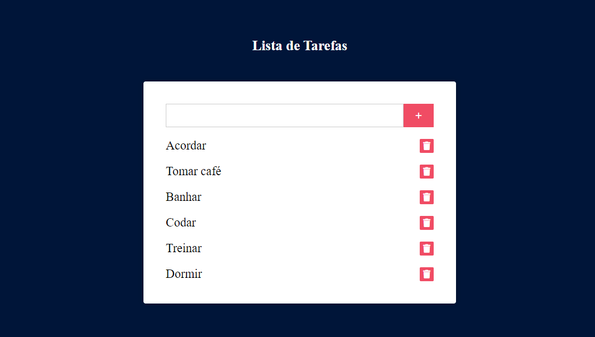

<h1 align="center"> Lista de Tarefas </h1>

  <a href="#-tecnologias">Tecnologias</a>&nbsp;&nbsp;&nbsp;|&nbsp;&nbsp;&nbsp;
  <a href="#-projeto">Projeto</a>&nbsp;&nbsp;&nbsp;

 

  

## 🚀 Tecnologias

Esse projeto foi desenvolvido com as seguintes tecnologias:

- HTML e CSS
- JavaScript
- Git e Github

## 💻 Projeto

Através do ambiente desenvolvido, armezene suas listas de afazeres para acompanhamento e realização!  
Acesse através de <a href="https://listadetarefas-two.vercel.app/">Lista de Tarefas</a>
